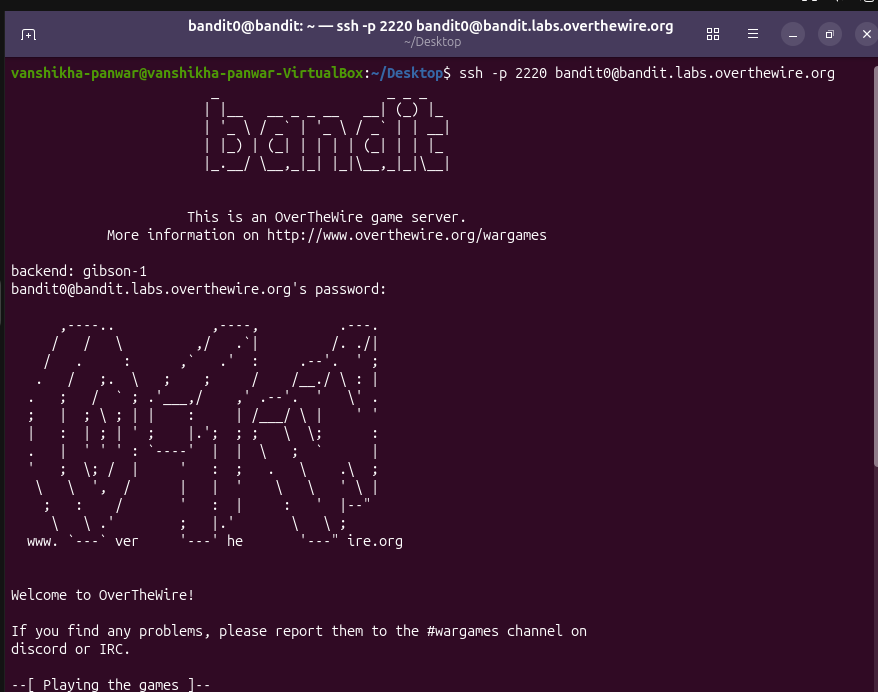
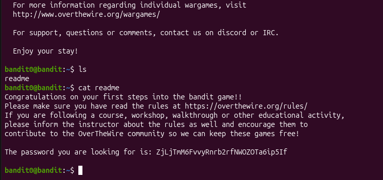

# Bandit Level 0 → 1

## Objective
Log into the game using SSH and find the password stored 
in a file called readme in the home directory.

## Commands Used
```bash
ssh -p 2220 bandit0@bandit.labs.overthewire.org 
ls
cat readme
```

## What I Learned
- How to SSH into a remote server using a custom port with -p flag
- ls lists files in current directory
- cat reads and prints file contents to terminal

## Screenshot



