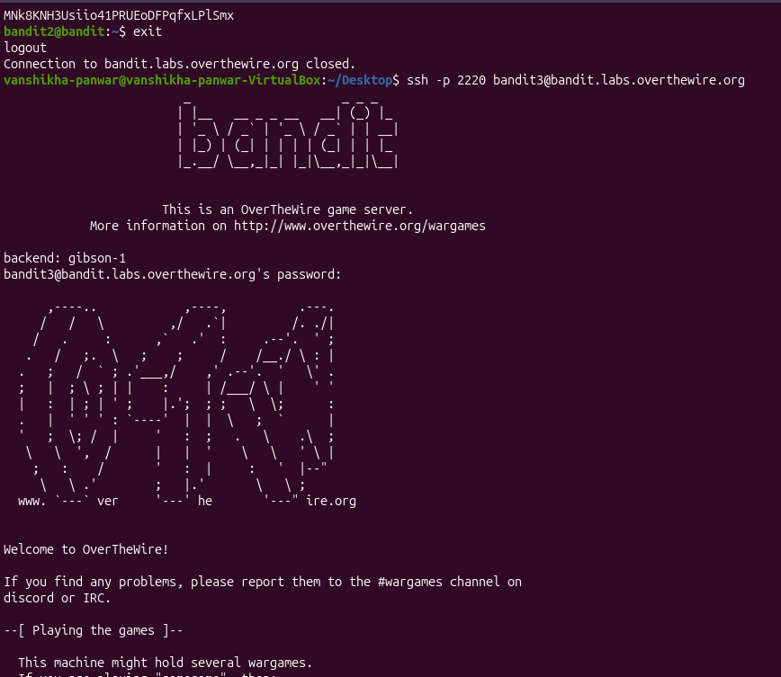
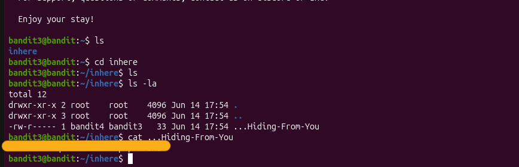

# Bandit Level 3 → 4

## Objective
Find the password stored in a hidden file inside the `inhere` directory.

## Challenge
The file was hidden (filename starts with `.`) so a normal `ls` 
wouldn't show it.

## Commands Used
```bash
ssh -p 2220 bandit3@bandit.labs.overthewire.org
ls
cd inhere
ls
ls -la
cat ...Hiding-From-You
```

## Why This Works
- `ls` only shows visible files — hidden files start with `.` 
  and are invisible by default
- `ls -la` shows ALL files including hidden ones (`-a` flag) 
  with detailed info (`-l` flag)
- The hidden file was named `...Hiding-From-You`

## What I Learned
- Hidden files in Linux start with a `.` in their filename
- `ls -la` is the go-to command to reveal hidden files with 
  full details (permissions, owner, size, date)
- Always run `ls -la` when exploring an unfamiliar directory 
  in security work — hidden files are commonly used to 
  conceal malicious scripts or stolen data

## Screenshot


